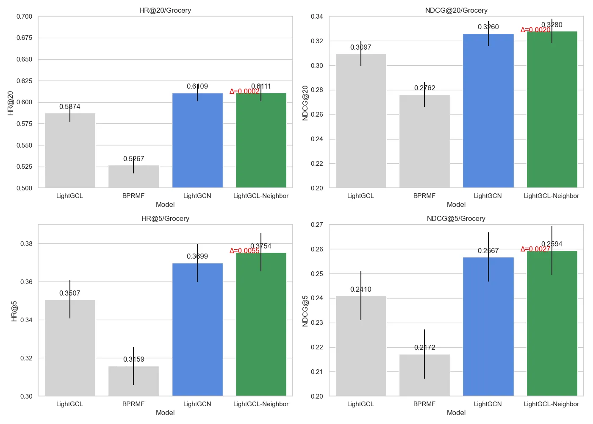
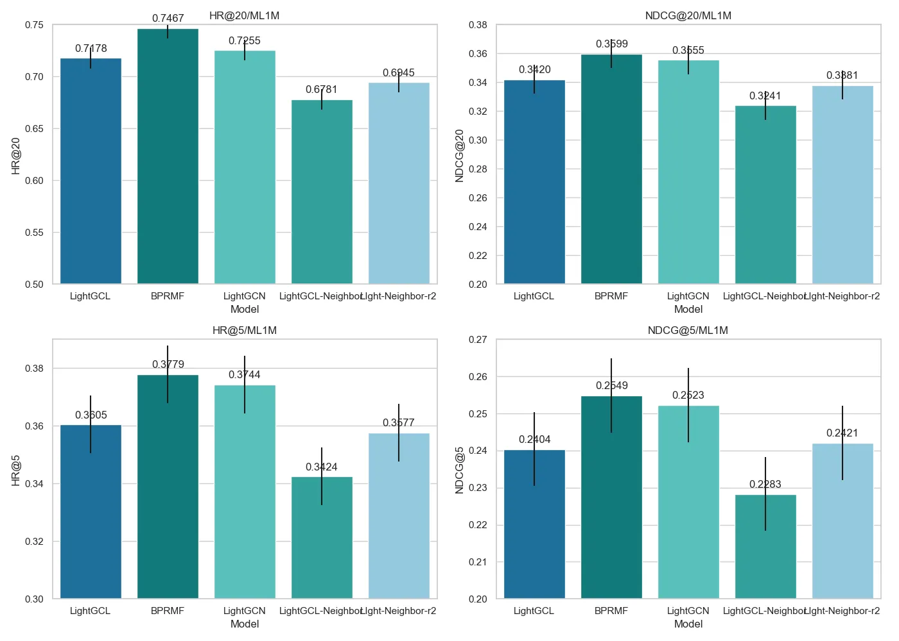

# LightGCL-ReChorus
### 机器学习实验大作业

#### 项目介绍
- - 以推荐系统为背景，采用[ReChorus2.0框架](https://github.com/THUwangcy/ReChorus)，复现[LightGCL模型](https://github.com/HKUDS/LightGCL)并改进然后进行一系列对比实验
---

#### 代码位置
- `src/general/LightGCL.py`：LightGCL模型
- `src/general/LightGCN_neighbor.py`：LightGCL改进模型

#### 模型运行
```bash
pip install -r requirements.txt
python main.py --model_name LightGCL
```


#### 实验结果
- 在[Grocery_and_Gourmet_Food](https://www.kaggle.com/datasets/shuyangli94/food-com-recipes-and-user-interactions)数据集上进行实验，实验结果如下：


| 模型 | HR@20/Grocery | NDCG@20/Grocery | Times/Grocery | HR@5/Grocery | NDCG@5/Grocery | Times/Grocery |
|------|---------------|-----------------|---------------|--------------|----------------|---------------|
| LightGCL | 0.5916 | 0.3093 | 216.2 | 0.3466 | 0.2382 | 217.8 |
| BPRMF | 0.5304 | 0.2801 | 72.6s | 0.3191 | 0.2195 | 158.3 |
| LightGCN | 0.6132 | 0.3266 | 221.8 s | 0.3710 | 0.2566 | 161.7 |
---
- 在[MovieLens-1M](https://grouplens.org/datasets/movielens/1m/)数据集上进行实验，实验结果如下：

| 模型 | HR@20/ML1M | NDCG@20/ML1M | Times/ML1M | HR@5/ML1M | NDCG@5/ML1M | Times/ML1M |
|------|------------|--------------|------------|-----------|-------------|------------|
| LightGCL | 0.6889 | 0.3308 | 2530.2 s | 0.3476 | 0.2343 | 2710.8 s |
| BPRMF | 0.7467 | 0.3598 | 207.1 s | 0.3793 | 0.2553 | 228.5 s |
| LightGCN | 0.7272 | 0.3541 | 1295.3 s | 0.3730 | 0.2534 | 1622.4 s |





